<div align="center">

# Sunnah Al-Hadi

[](https://github.com/sarfrazryenpsd/Sunnah-Al-Hadi/actions/workflows/sunnah_ci.yml)
[](https://kotlinlang.org/)
[](https://developer.android.com/)
[](https://developer.android.com/jetpack/compose)
[](https://dagger.dev/hilt/)
[](https://developer.android.com/training/data-storage/room)
[](LICENSE)


<a href="https://play.google.com/store/apps/details?id=com.ryen.sunnah_alhadi" target="_blank">
</a>
</div>


## 🕌 About the Project

**Sunnah Al-Hadi** is a comprehensive Android application that provides Muslims with an extensive
collection of Prophetic traditions (Sunnah) and Islamic manners from the life of Prophet Muhammad ﷺ.
The app serves as a digital guide to help users incorporate these blessed practices into their daily
lives.

### 🎯 Mission

To make the beautiful Sunnah of our beloved Prophet ﷺ easily accessible to Muslims worldwide,
helping them follow his guidance in their daily routines through a modern, user-friendly interface.

## ✨ Key Features

- **470+ Authentic Sunnahs**: Curated collection from Sahih al-Bukhari, Sahih Muslim, Sunan Abu
  Dawood, Jami' al-Tirmidhi, and classical Islamic works
- **Categorized Content**: Organized by daily activities and occasions for easy navigation
- **Dual Language Support**: Arabic texts with English translations
- **Bookmarking System**: Save your favorite Sunnahs for quick reference
- **Daily Reminders**: Get gentle notifications about the "Sunnah of the Day"
- **Fully Offline**: No internet connection required after installation
- **Privacy Focused**: No personal data collection, local storage only

## 📱 Screenshots

**Light**

| | | |
|---|---|---|
| 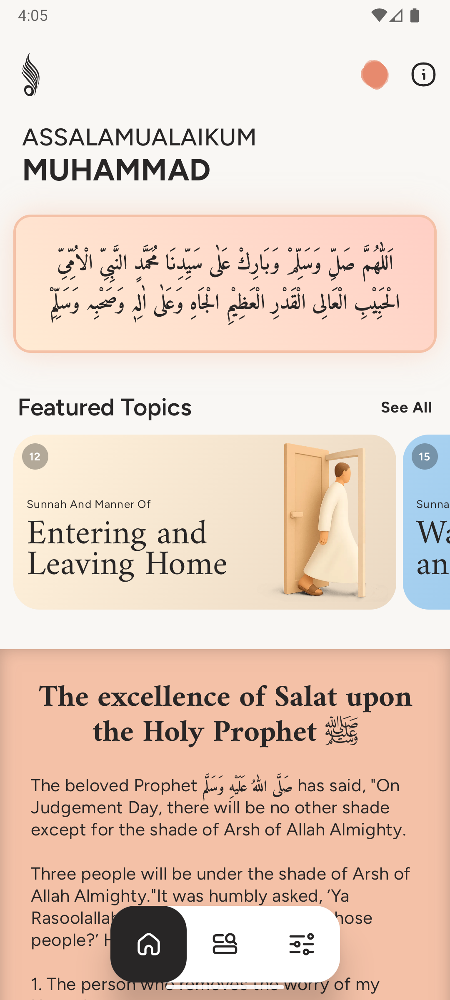 | 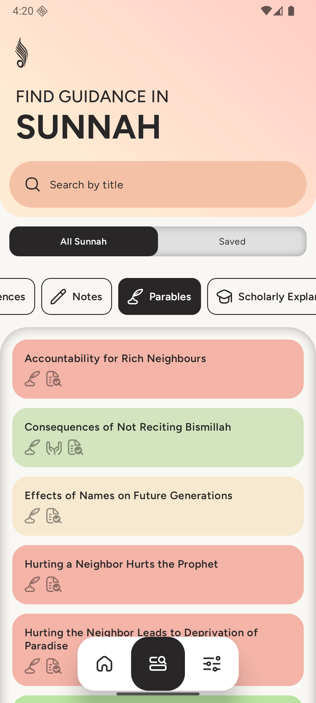 | 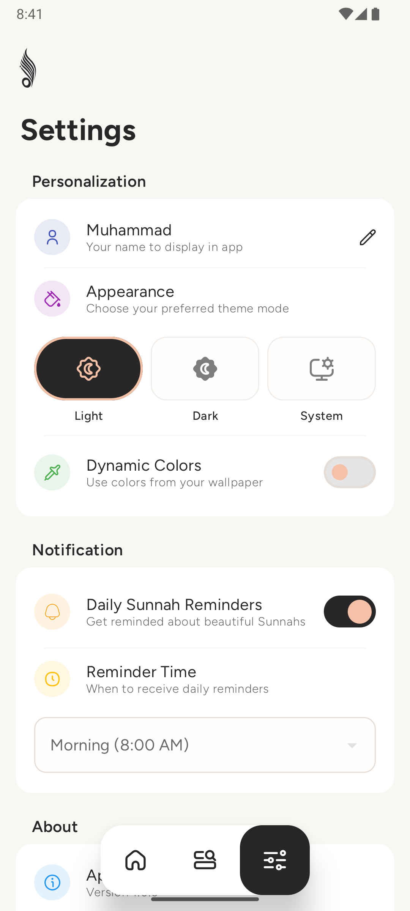 |
| 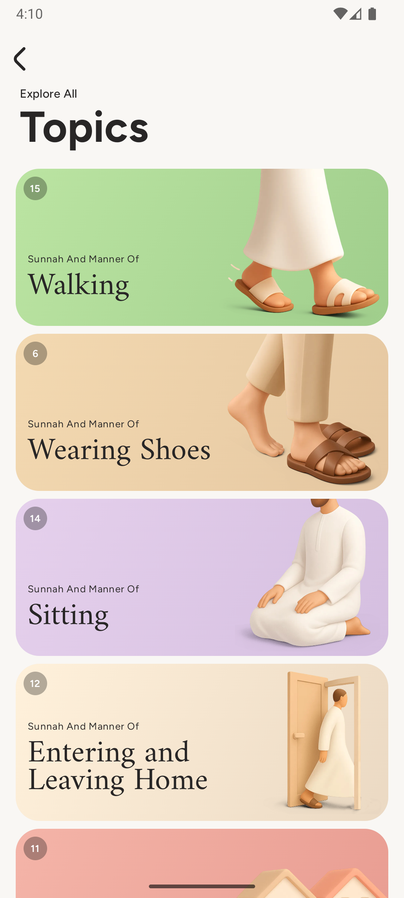 | 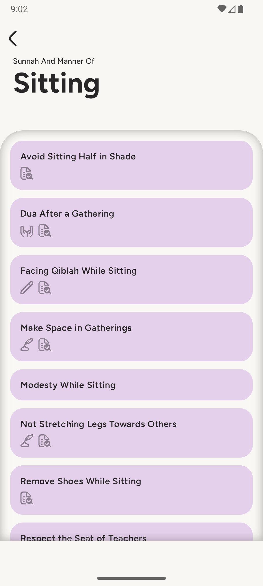 | 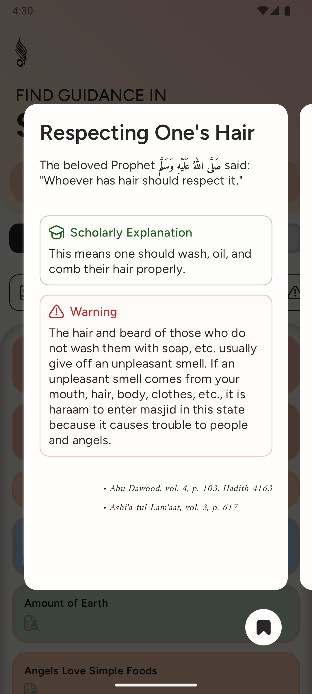 |

| | | |
|---|---|---|
| 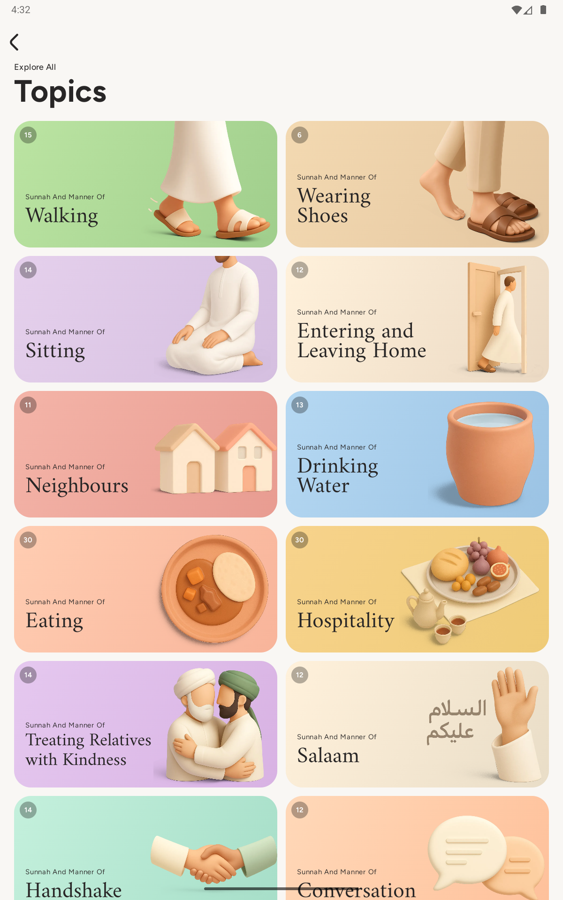 | 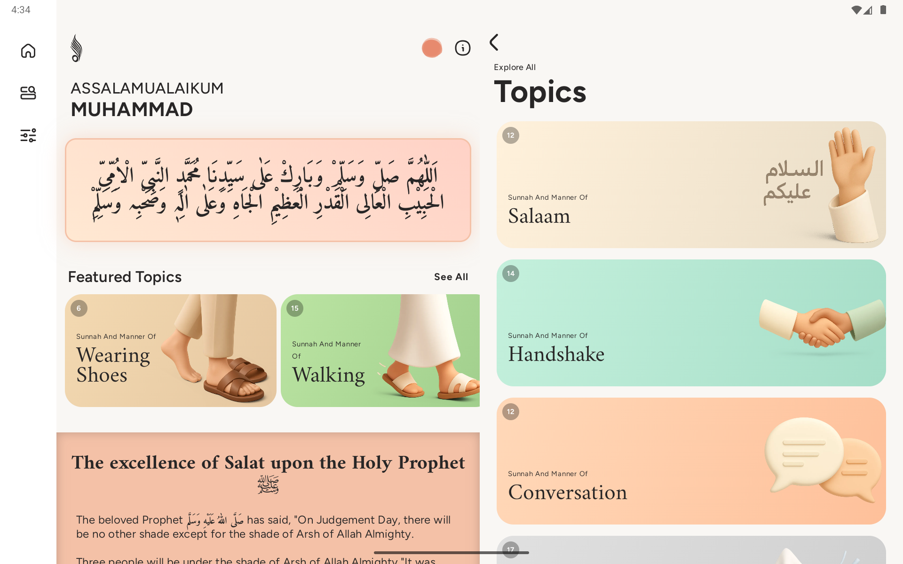 | 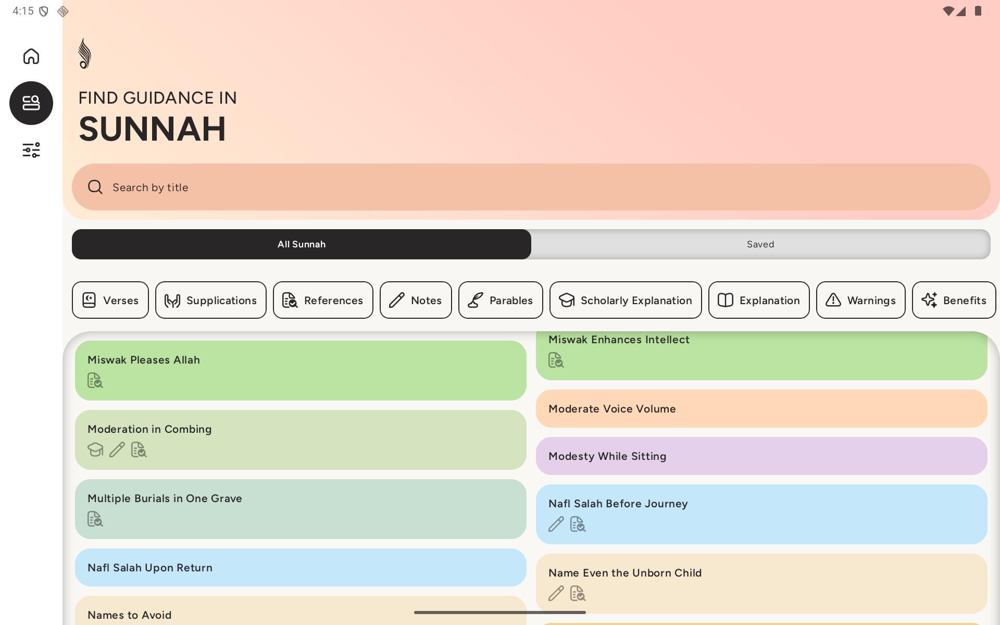 |

**Dark**

| | | |
|---|---|---|
| 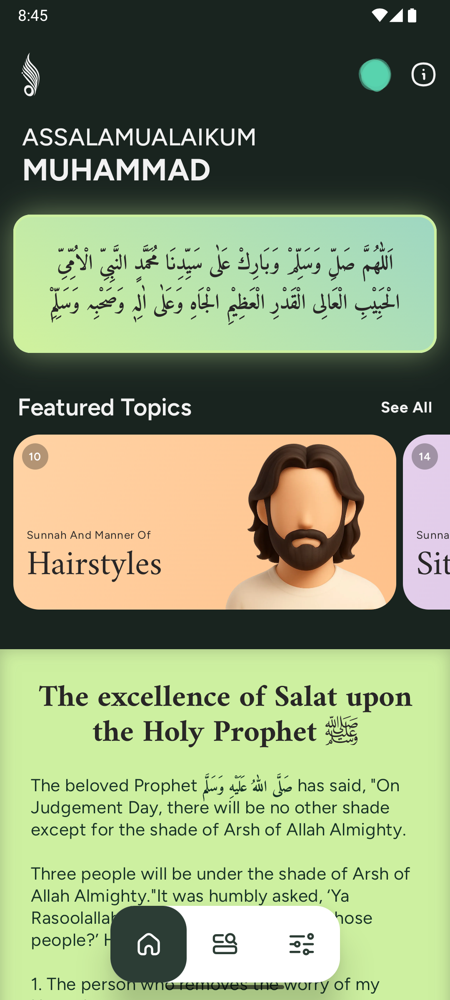 | 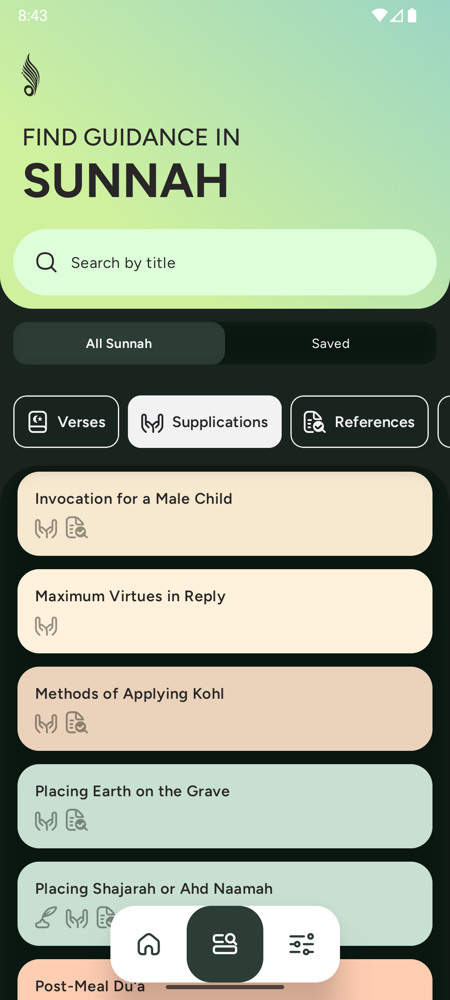 | 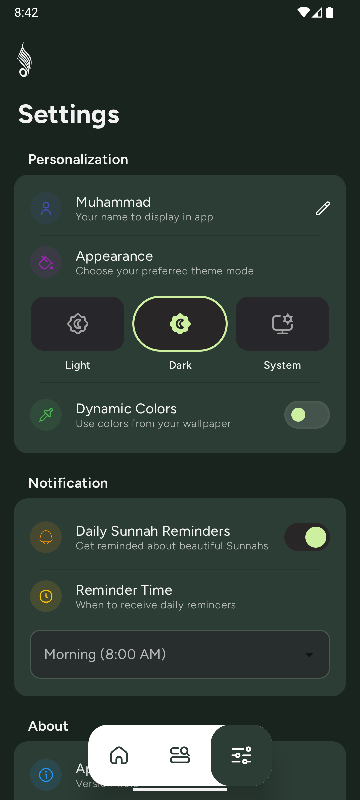 |
| 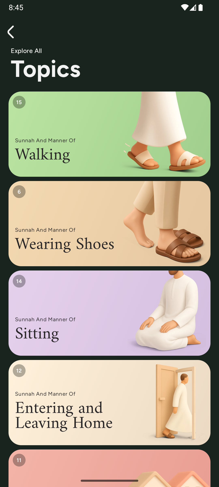 | 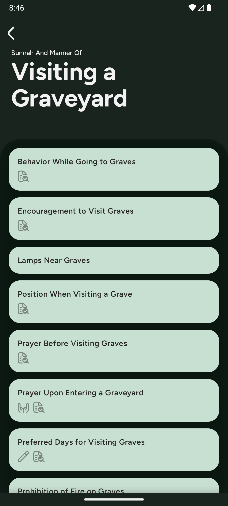 | 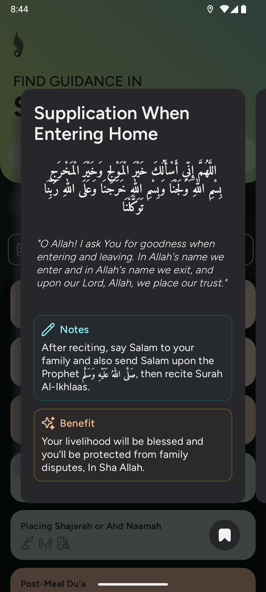 |

| | | |
|---|---|---|
| 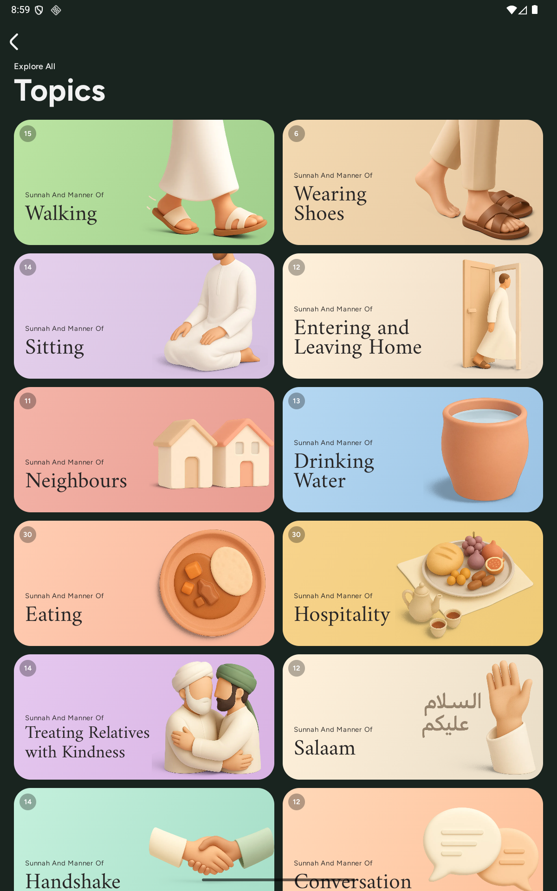 | 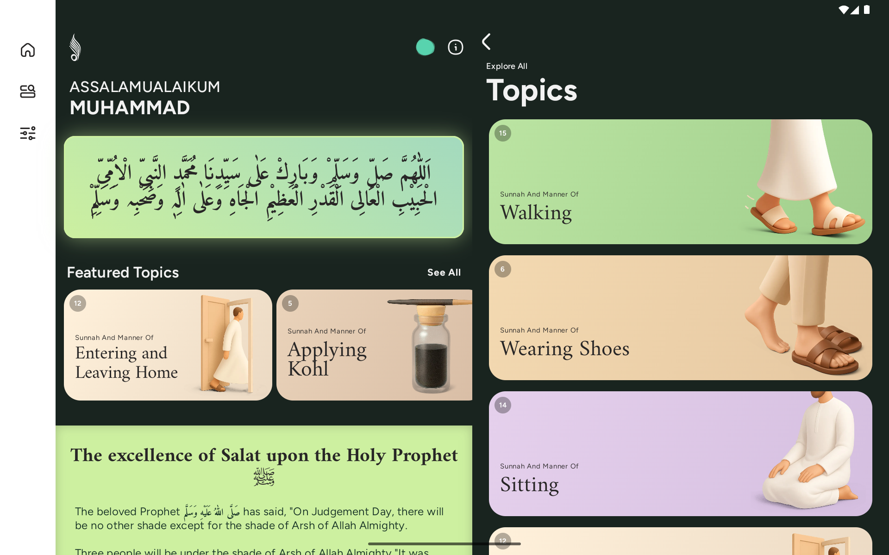 | 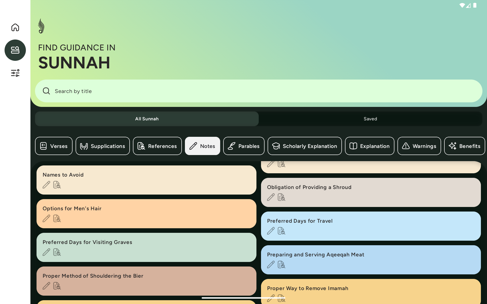 |

## 🛠️ Technical Implementation

This project demonstrates modern Android development practices with a clean architecture approach:

### Architecture & Design Patterns

- **MVVM (Model-View-ViewModel)**: Clear separation of concerns for maintainable code
- **Clean Architecture**: Well-defined layers with domain, data, and presentation modules
- **Repository Pattern**: Abstracts data sources and provides a clean API for data access
- **SOLID Principles**: Code is organized to follow object-oriented design principles
- **Dependency Injection**: Hilt for managing dependencies throughout the application

### Technologies & Frameworks

#### Core Technologies

- **Kotlin**: Primary programming language with coroutines for asynchronous operations
- **Jetpack Compose**: Modern UI toolkit for building declarative interfaces
- **Compose Multiplatform**: Cross-platform UI development (Material 3 design system)
- **Android Architecture Components**: ViewModel, LiveData, StateFlow for reactive UI

#### Data Management

- **Room Database**: Local storage for Sunnah content with compile-time verification
- **DataStore**: Preferences management using Proto DataStore for type safety
- **Protobuf**: For efficient serialization of user preferences
- **Coil**: Image loading and caching solution

#### Background Processing

- **WorkManager**: For scheduled tasks like syncing bug reports
- **Custom Workers**: Background processing for non-critical operations

#### Navigation & Structure

- **Compose Navigation 3**: Single-activity architecture with composable destinations
- **Window Size Classes**: Adaptive layout for different screen sizes

#### Testing

- **Unit Tests**: JUnit, MockK, and Truth for testing business logic
- **UI Tests**: Compose testing framework for UI component verification
- **Hilt Testing**: Dependency injection testing support
- **Turbine**: For testing Kotlin Flows

#### Monitoring & Analytics

- **Firebase Crashlytics**: For error reporting and app stability monitoring
- **Firebase Analytics**: For understanding user engagement patterns

### Project Structure

```
com.ryen.sunnah_alhadi
├── data/
│   ├── local/         # Room database implementation
│   ├── datastore/    # Proto DataStore preferences
│   ├── model/        # Data models
│   └── repository/  # Repository implementations
├── domain/
│   ├── model/        # Domain models
│   ├── repository/   # Repository interfaces
│   └── useCase/      # Business logic encapsulation
├── presentation/
│   ├── screens/      # UI screens and components
│   ├── navigation/  # App navigation logic
│   └── common/      # Shared UI components
├── platform/
│   ├── notification/ # Notification management
│   ├── scheduler/    # Notification scheduling
│   └── worker/       # Background workers
├── di/              # Dependency injection modules
└── ui/              # Theme and styling
```

### Notable Technical Features

- **Asynchronous Initialization**: Application components are initialized in a staggered manner to
  optimize startup time
- **Theme Management**: Dynamic color support with theme mode selection (light/dark/system)
- **Adaptive UI**: Window size class implementation for different device form factors
- **Local Notifications**: Scheduling system for daily Sunnah reminders
- **Offline-First Design**: All content stored locally with no required network calls
- **Privacy-First Approach**: No data collection, everything stays on-device

## 🏗️ Development Setup

1. Clone the repository
2. Open in Android Studio (preferably latest stable version)
3. Sync Gradle dependencies
4. Build and run the project

### Prerequisites

- Android Studio Iguana or later
- JDK 11+
- Android SDK 36 (compileSdk)

## 📦 Dependencies

Key dependencies include:

- Jetpack Compose BOM for consistent Compose versions
- Room database with KSP compiler
- Hilt for dependency injection
- Kotlinx Serialization for JSON handling
- Firebase BOM for analytics and crash reporting
- Lottie for animations
- WorkManager for background tasks
- DataStore for preferences

## 🔧 Testing

The project includes comprehensive tests:

- Unit tests for ViewModels and use cases
- UI tests for composables
- Integration tests for repository layers
- Background worker tests

Run tests with:

```bash
./gradlew test
```

## 📚 Sources

Content compiled from authentic Islamic sources:

- Sahih al-Bukhari
- Sahih Muslim
- Sunan Abu Dawood
- Jami' al-Tirmidhi
- Bahar-e-Shariat
- Fatawa Alamgiri
- Fatawa Razawiya
- Ihya' 'Ulum al-Din

## 📜 License

This project is licensed under the MIT License - see the [LICENSE](LICENSE) file for details.

## 🙏 Islamic Disclaimer

While we strive for accuracy in accordance with Islamic principles, users should consult qualified
Islamic scholars for important religious decisions. Content is provided "as is" for educational
purposes.

---

## 📞 Contact

For inquiries, feedback, or support: mdsarfraz.ilanos1915@gmail.com
